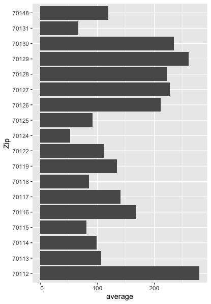

  <script type="text/javascript" src="https://public.tableau.com/javascripts/api/tableau-2.8.0.min.js">
  
</script>>

<script src="tableau.js">

</script>
 
# Crime Rates Over Time
## By Brian Walsh
### May, 2021

;lksadj ;alsjkd asjk as;lkdj as;lkdj ;lkdj a;lsdkjhas ;ldkj askl;djas;lk djk ;ldkjas l;kjd ;lakj l;kajd ;ljk

[How to use Markdown](https://guides.github.com/features/mastering-markdown/)

``` r

vaccinated <- nyt_search('vaccinated', n=2000)

as.data.frame(vaccine) -> vaccinedf

View(vaccinedf)
library(tidytext)

vaccinedf %>% 
  unnest_tokens(word, lead_paragraph) %>% 
  anti_join(stop_words) %>% 
  count(word, sort = TRUE) %>% 
  inner_join(get_sentiments('afinn'))

```

|word        |  n| value|
|:-----------|--:|-----:|
|crisis      |  2|    -3|
|warning     |  2|    -3|
|worse       |  2|    -3|
|advantage   |  1|     2|
|care        |  1|     2|
|cry         |  1|    -1|
|death       |  1|    -2|
|devastating |  1|    -2|
|difficult   |  1|    -1|
|discard     |  1|    -1|
|envy        |  1|    -1|
|escape      |  1|    -1|




<div id="tableauViz"></div>


